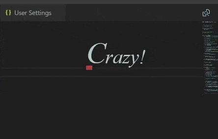

# Style Meter

This party's getting crazy! Become motivated with a Devil May Cry-like style meter in VSCode. Type faster to increase your style ranking.

Heavily inspired by [Power Mode](https://marketplace.visualstudio.com/items?itemName=hoovercj.vscode-power-mode).

## Features

- A meter and ranking text show your current style ranking.
- User-specified music plays at higher volume for higher ranks.

## Requirements

A [`play-sound`](https://github.com/shime/play-sound#options) compatible audio player must be installed to play music, though other parts of the extension will still work without one.

## Settings

- `styleMeter.musicFilePath`: Sets a local file to play music from.
- `styleMeter.maxVolume`: Sets the max volume from 0 to 1 that the music will play at.
- `styleMeter.gainFactor`: Easy mode is now selectable. Sets a multiplier to style points gained.
- `styleMeter.degradationFactor`: Sets a multiplier to style points lost over time.

## Known Issues

- The rank text will sometimes become misaligned with rest of the style meter.
- The style meter and ranking do not follow horizontal scrolling.
- The system volume will change if music is specified.
- Only the first open workspace will change volume if music is specified.
